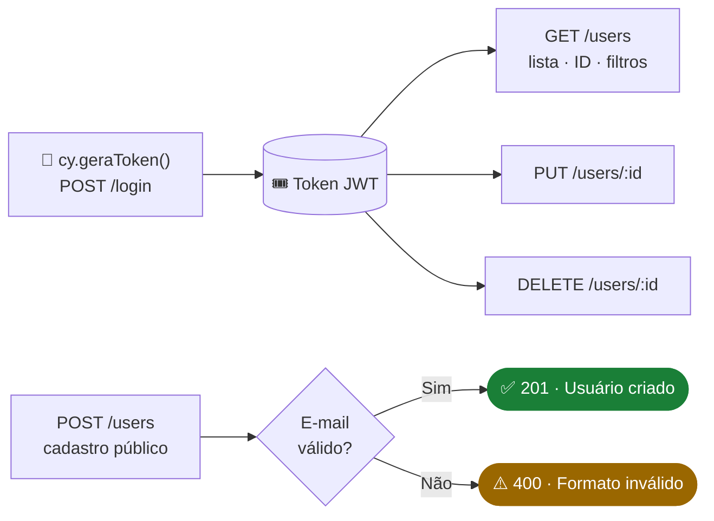
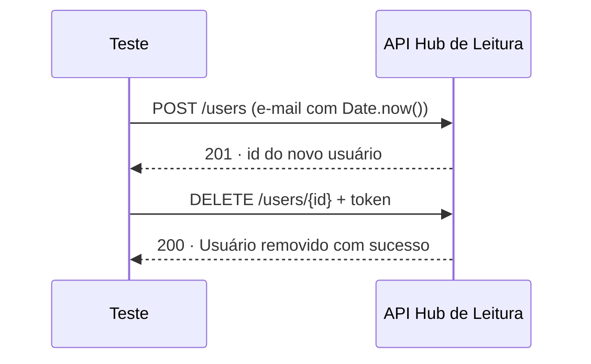
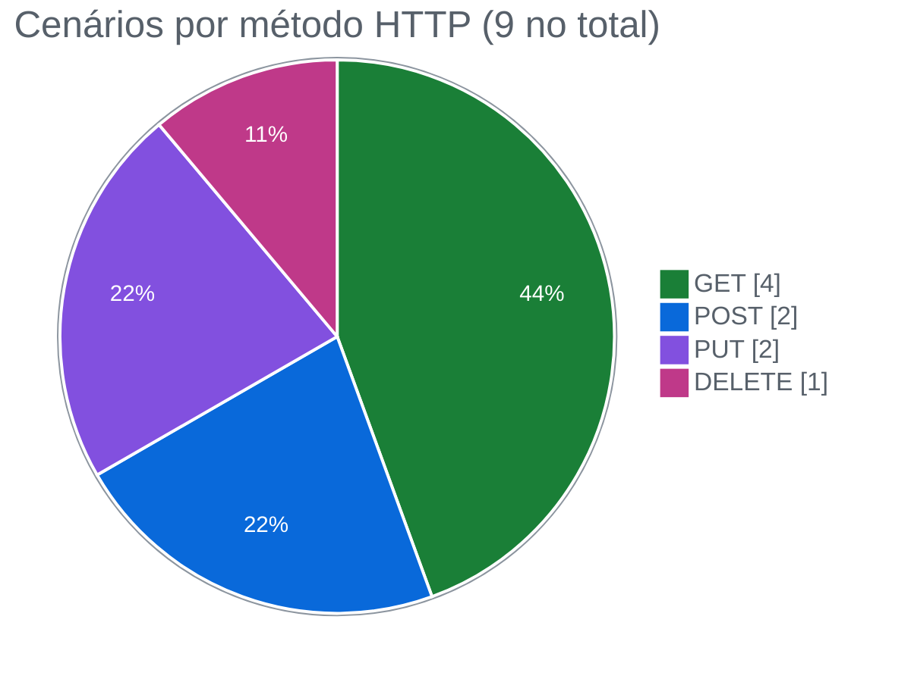
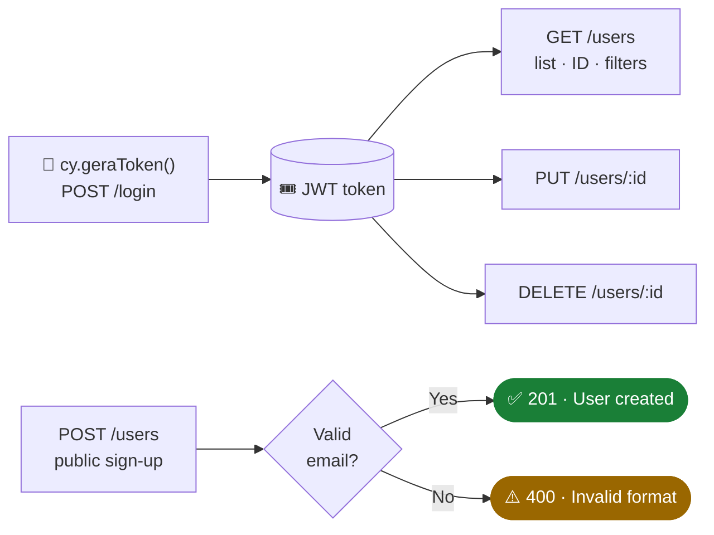

<div align="center">

# 📚 Hub de Leitura · Testes de API REST com Cypress

**Automatizei o CRUD completo de usuários de uma API de biblioteca, com autenticação por token, dados dinâmicos e cenários negativos**


🇧🇷 [Português](#-português) · 🇺🇸 [English](#-english)

</div>

---

## 🇧🇷 Português

### 🎯 Objetivo

Depois de automatizar a interface do Hub de Leitura, desci uma camada e fui testar a **API** que sustenta a plataforma. Teste de API roda mais rápido que teste de tela, quebra menos e pega o erro mais perto da origem.

O foco foi o módulo de **gestão de usuários**, validando os quatro métodos HTTP:

| Método | O que eu quis garantir |
|---|---|
| `GET` | Que a listagem, a busca por ID e os filtros devolvem os dados certos, com a estrutura esperada |
| `POST` | Que o cadastro funciona e que a API **recusa e-mail inválido** |
| `PUT` | Que a atualização de dados é aplicada |
| `DELETE` | Que a remoção de usuário funciona |

### 🧭 Estratégia

Toda rota protegida exige token. Criei um comando customizado que faz o login e devolve o token antes de cada teste, e assim nenhum cenário depende de credencial fixa no meio do código.



**Dados que não colidem.** Nos testes de `PUT` e `DELETE`, crio um usuário novo na hora com `cy.cadastrarUsuario()`, pego o ID que a API devolve e faço a operação em cima dele. Cada teste gera e limpa o próprio dado, sem depender de registros que já estavam no banco.



### 🧪 Cobertura



| # | Método | Cenário | Validações |
|:-:|:-:|---|---|
| 1 | `GET` | Listar usuários | Status 200 e `users` é um array |
| 2 | `GET` | Validar propriedades de um usuário | `id`, `name` e `email` presentes |
| 3 | `GET` | Buscar usuário por ID | Status 200 e estrutura do objeto |
| 4 | `GET` | Listar com filtro e paginação | Query params `page`, `limit` e `search` |
| 5 | `POST` | Cadastrar usuário | Status 201 e mensagem de sucesso |
| 6 | `POST` | Cadastrar com e-mail inválido | ⚠️ Status 400 e `Formato de email inválido.` |
| 7 | `PUT` | Atualizar usuário existente | Status 200 e mensagem de sucesso |
| 8 | `PUT` | Atualizar usuário criado no próprio teste | Cadastro + atualização encadeados |
| 9 | `DELETE` | Excluir usuário criado no próprio teste | Cadastro + exclusão encadeados |

### 🧰 Técnicas que apliquei

| Técnica | Implementação |
|---|---|
| Autenticação reutilizável | `cy.geraToken()` no `beforeEach` |
| Criação de massa sob demanda | `cy.cadastrarUsuario()` devolve o ID do novo usuário |
| Dados únicos | E-mail gerado com `Date.now()` |
| Teste negativo | `failOnStatusCode: false` para validar o erro 400 |
| Validação de contrato básico | Checagem de propriedades obrigatórias da resposta |
| Visualização das chamadas | `cypress-plugin-api`, que mostra request e response na tela do Cypress |

### 📈 Resultados

- **Cobri os 4 métodos do CRUD** do módulo de usuários, incluindo rotas autenticadas.
- **Validei regra de negócio pelo lado negativo:** a API precisa recusar e-mail mal formatado, e a suíte confere o status e a mensagem.
- **Deixei os testes independentes entre si:** cada cenário de escrita cria o próprio usuário, então a ordem de execução não interfere no resultado.
- **Tornei as chamadas visíveis:** com o `cypress-plugin-api`, cada request e response aparece na tela do Cypress, o que facilita a análise de uma falha.

### 🚀 Onde esse trabalho se aplica

- **Teste de regressão rápido:** a suíte de API roda em segundos, bem antes dos testes de interface, e segura o problema na camada certa.
- **Contrato entre front e back:** as checagens de propriedades avisam se algum campo sumir da resposta e quebrar a tela.
- **Base para os outros módulos:** o mesmo padrão (token + criação de massa + validação) serve para livros, empréstimos e reservas.
- **Integração com os testes de carga:** a mesma API foi usada no [projeto de performance com k6](https://github.com/gustavoanderson/hub-de-leitura-teste-de-carga-k6).

### ▶️ Como executar

**Pré-requisitos:** Node.js e a API do Hub de Leitura rodando em `http://localhost:3000/api/`.

```bash
npm install
npx cypress open   # modo interativo, com o painel do cypress-plugin-api
npx cypress run    # modo headless
```

### 📁 Estrutura

```
cypress/
├── e2e/
│   └── usuarios.cy.js     # CRUD de usuários
└── support/
    └── commands.js        # cy.geraToken() · cy.cadastrarUsuario()
```

---

## 🇺🇸 English

### 🎯 Goal

After automating the Hub de Leitura UI, I went one layer down and tested the **API** behind the platform. API tests run faster than UI tests, break less and catch errors closer to the source.

I focused on the **user management** module, covering all four HTTP methods: `GET` (listing, search by ID and filters), `POST` (sign-up, including **rejecting invalid emails**), `PUT` (updates) and `DELETE` (removal).

### 🧭 Strategy

Every protected route requires a token. I built a custom command that logs in and returns the token before each test, so no scenario relies on hard-coded credentials.



For `PUT` and `DELETE`, I create a fresh user inside the test with `cy.cadastrarUsuario()`, take the returned ID and run the operation on it. Each test creates its own data and doesn't depend on existing records.

### 🧪 Coverage


### 📈 Results

- **I covered all 4 CRUD methods** of the user module, including authenticated routes.
- **I validated a business rule from the negative side:** the API must reject a malformed email, and the suite checks both status and message.
- **I kept tests independent:** each write scenario creates its own user, so execution order doesn't affect results.
- **I made every call visible:** with `cypress-plugin-api`, each request and response shows up in the Cypress runner.

### 🚀 Where this applies

- **Fast regression:** the API suite runs in seconds, well before UI tests.
- **Front/back contract:** property checks flag any field that disappears from the response.
- **Other modules:** the same pattern (token + on-demand data + validation) works for books, loans and reservations.
- **Load testing:** I used the same API in my [k6 performance project](https://github.com/gustavoanderson/hub-de-leitura-teste-de-carga-k6).

### ▶️ How to run

```bash
npm install
npx cypress open   # interactive
npx cypress run    # headless
```

---

<div align="center">

Feito por **Gustavo Anderson** · QA Engineer
[](https://www.linkedin.com/in/gustavo-anderson)
[](https://github.com/gustavoanderson)

</div>
